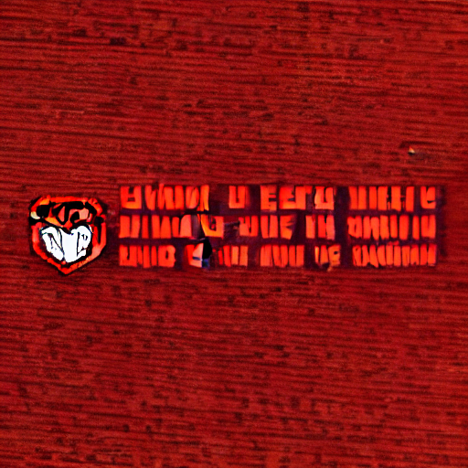
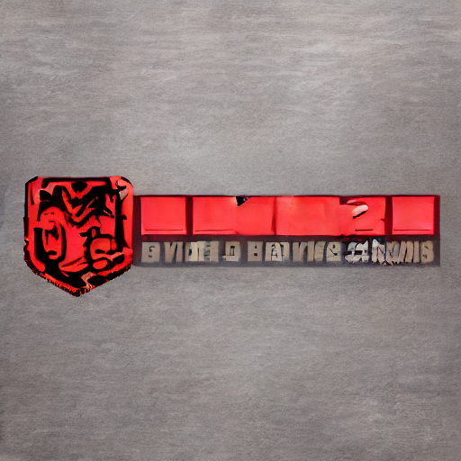

---
license: creativeml-openrail-m
base_model: runwayml/stable-diffusion-v1-5
tags:
- stable-diffusion
- stable-diffusion-diffusers
- text-to-image
- diffusers
- lora
inference: true
---
    
# LoRA text2image fine-tuning - prushton/logo-lora-real-world
These are LoRA adaption weights for runwayml/stable-diffusion-v1-5. The weights were fine-tuned on the mdass/gpt_gen_desc_logos dataset. You can find some example images in the following. 

